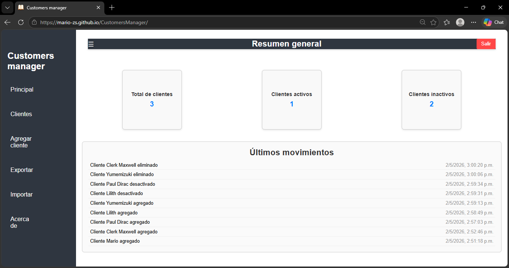
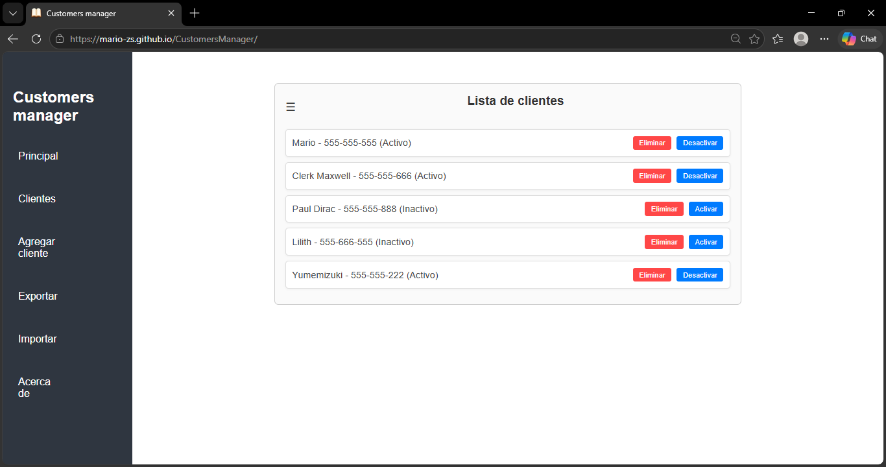
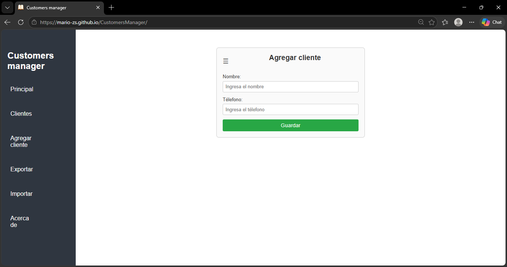
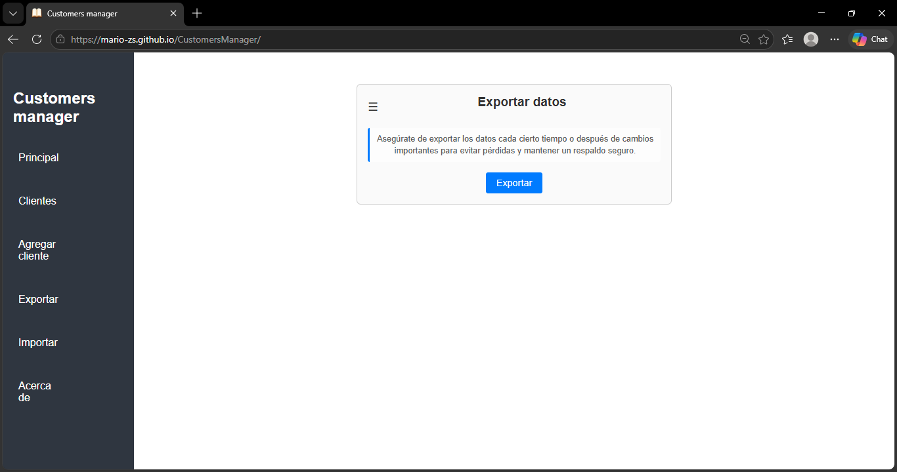
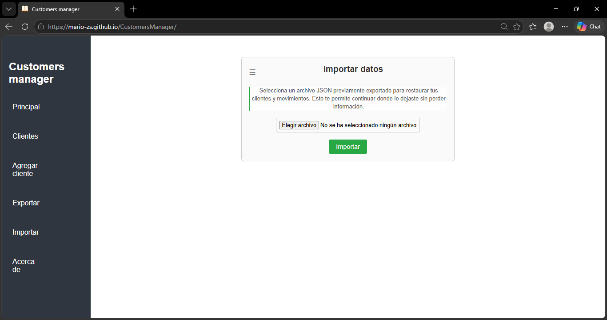

# 📦 Customers Manager

Aplicación web desarrollada en JavaScript para la gestión de clientes.
Permite registrar, administrar y persistir información de clientes directamente desde el navegador.

---

## 🌐 Demo

Puedes probar la aplicación aquí:

👉 https://mario-zs.github.io/CustomersManager/

---

## 🧾 Descripción

**Customers Manager** es una aplicación web enfocada en la gestión básica de clientes sin necesidad de backend.

Incluye un sistema de navegación tipo dashboard, un login simulado y funcionalidades para exportar e importar datos en formato JSON.

Los datos se almacenan utilizando **LocalStorage**, lo que permite persistencia sin base de datos externa.

---

## ⚙️ Funcionalidades

### 🔐 Acceso

* Login simulado (solo requiere nombre de usuario)
* Acceso directo al dashboard

### 👥 Gestión de clientes

* Agregar clientes
* Eliminar clientes
* Activar / desactivar clientes
* Visualización de lista

### 📊 Movimientos

* Registro de acciones realizadas
* Historial de actividad reciente

### 💾 Persistencia

* Guardado automático en LocalStorage

### 📤 Exportación / Importación

* Exportar clientes en archivo JSON
* Importar datos desde archivo JSON
* Validación básica de archivos

### 📌 Navegación

* Sidebar interactivo
* Secciones dinámicas sin recarga

---

## 🛠️ Tecnologías utilizadas

* JavaScript (ES6 Modules)
* HTML5
* CSS3
* LocalStorage API

---

## 🧠 Conceptos aplicados

* Modularización del código (`import/export`)
* Manipulación del DOM
* Manejo de eventos
* Persistencia en cliente
* Lectura de archivos (FileReader API)
* Generación de archivos (Blob API)
* Arquitectura separada por responsabilidades

---

## 📂 Estructura del proyecto

```
CustomersManager/
│
├── index.html
├── style.css
├── app.js
├── data.js
├── events.js
├── ui.js
│
└── resources/
    └── logo.png
```

---

## 🚀 Instalación y ejecución

### 🔹 Opción 1: GitHub Pages

Accede directamente desde el navegador:

👉 https://mario-zs.github.io/CustomersManager/

---

### 🔹 Opción 2: Ejecución local

Debido al uso de módulos (`type="module"`), la aplicación requiere un servidor local.

#### Con Live Server (recomendado)

1. Abrir el proyecto en **Visual Studio Code**
2. Instalar la extensión **Live Server**
3. Ejecutar `index.html` con:

   ```
   Open with Live Server
   ```

---

## ⚠️ Advertencia

Los datos se almacenan únicamente en el navegador mediante LocalStorage.

Pueden perderse si:

* Se borra la caché del navegador
* Se cambia de dispositivo o navegador
* Se reinstala el navegador con limpieza de datos

El desarrollador no se hace responsable por la pérdida de información.

---

## 📸 Capturas de pantalla

### Principal


### Lista de clientes


### Agregar cliente


### Exportar datos


### Importar datos


---

## 📈 Posibles mejoras

* Autenticación real de usuarios
* Base de datos externa (API / Backend)
* Sincronización en la nube
* Búsqueda y filtrado de clientes
* UI/UX más avanzada
* Implementar validaciones más robustas

---

## 📄 Licencia

MIT License


**Desarrollado por Mario Alberto Melgarejo Villaseñor © 2026**
